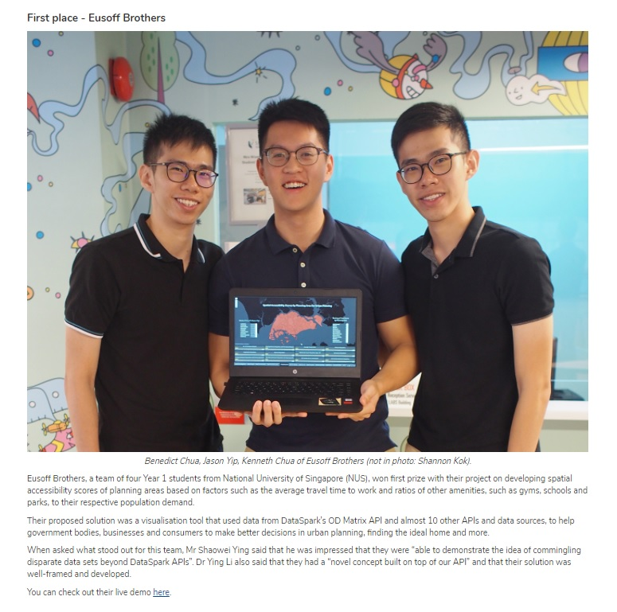

# Spatial Accessiblity Scores by Planning Area in Singapore
Fully functional dashboard application developed within 48 hours which won First Place in the IDE@DataSpark Open Hackathon.

See:
https://www.datasparkanalytics.com/post/working-hd-tertiary-students-impress-at-ide-dataspark-hackathon

Used DataSpark’s Mobility Intelligence APIs to create a fully-functional dashboard application for users to assess Spatial Accessibility Scores by Planning Areas in Singapore. Extracted and cleaned data with R, Node.js and Excel, Visualizations with Tableau. Formulated a statistical model to compare accessibility to amenities and overall accessibility across regions in Singapore.

Files include presentation deck which explains our purpose and methodology, and the Tableau workbooks to access the dashboard.

Try it out here:
https://public.tableau.com/views/SpatialAccessibilitybyPlanningAreasinSingapore/Dashboard2?:embed=y&:display_count=yes
